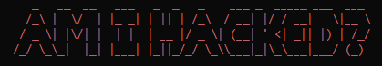
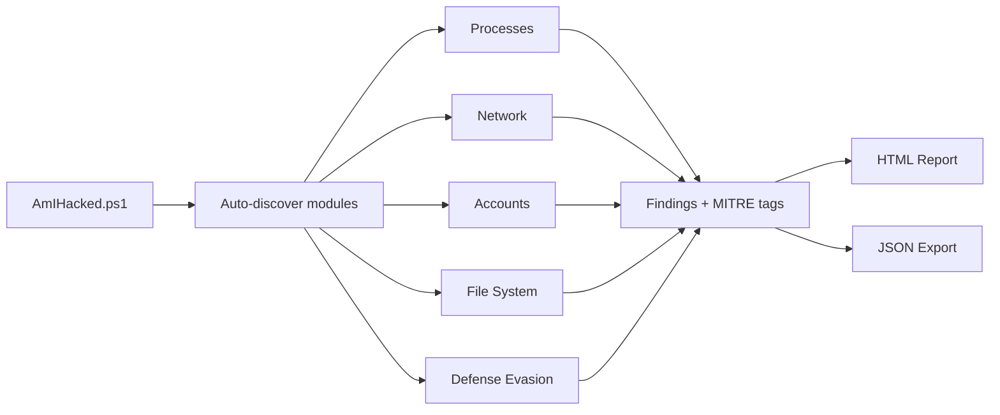

<div align="center">



**Zero-dependency Windows security assessment tool.**<br>
**Finds compromise indicators. Generates an interactive HTML report. Maps everything to MITRE ATT&CK.**

`CRITICAL` -- strong IOC, act now &nbsp;|&nbsp; `WARNING` -- suspicious, investigate &nbsp;|&nbsp; `INFO` -- worth noting

<br>

[](https://docs.microsoft.com/powershell/)
[](https://www.microsoft.com/windows)
[](LICENSE)
[](#changelog)

[](#)
[](#mitre-attck-coverage)
[](#modules)
[](#configuration)
[](#quick-start)
[](CONTRIBUTING.md)

</div>

---

## Why This Exists

Most security tools are either enterprise-grade ($$$ + agents + cloud) or script-kiddie one-liners that check 3 things. **Am I Hacked?** fills the gap: a single PowerShell script that runs 70+ heuristic checks across 5 security domains, produces an actionable HTML report, and requires zero installation, zero dependencies, zero internet.

**Run it. Read the report. Know where you stand.**

### How It Works



---

## Quick Start

```powershell
git clone https://github.com/TMHSDigital/Am-I-Hacked.git
cd Am-I-Hacked

# Run as Administrator for full results
.\AmIHacked.ps1
```

The report opens automatically in your browser. Findings are severity-colored (CRITICAL / WARNING / INFO), tagged with MITRE ATT&CK technique IDs, and include copy-paste remediation commands.

<details>
<summary><strong>First time? Create a baseline first.</strong></summary>

```powershell
# Step 1 — On a known-clean system, snapshot the current state
.\AmIHacked.ps1 -CreateBaseline

# Step 2 — Run scans any time later. Changes since baseline are flagged automatically.
.\AmIHacked.ps1
```

Baselines enable **change detection** — the most powerful signal for catching compromises. New ports, services, accounts, autorun entries, and scheduled tasks are flagged against your clean snapshot.

> Baselines are only exported when you pass `-CreateBaseline`. A compromised scan cannot overwrite your clean baseline.

</details>

---

## Usage

```powershell
# Offline mode — no API calls (VirusTotal, AbuseIPDB)
.\AmIHacked.ps1 -Offline

# Export JSON alongside HTML
.\AmIHacked.ps1 -ExportJson

# Skip specific modules
.\AmIHacked.ps1 -SkipModules Network,Accounts

# Compare against a specific baseline
.\AmIHacked.ps1 -BaselinePath C:\Backups\clean_baseline.json

# Custom output directory
.\AmIHacked.ps1 -OutputPath "C:\SecurityReports"

# Mask operator identity in output (for screenshots / sharing)
.\AmIHacked.ps1 -Redact

# CI / AI agent mode (structured JSON summary + exit code)
.\AmIHacked.ps1 -CIMode -ExportJson -Offline
```

| Parameter | Description |
|-----------|-------------|
| `-OutputPath` | Report output directory (default: `.\reports`) |
| `-SkipModules` | Module names to skip (e.g. `Network,Accounts`) |
| `-ConfigPath` | Path to `config.json` (default: `.\config\config.json`) |
| `-Offline` | Disable all external API calls |
| `-BaselinePath` | Path to a specific baseline JSON |
| `-CreateBaseline` | Snapshot current system state |
| `-ExportJson` | Emit findings as JSON alongside HTML |
| `-VerboseOutput` | Enable verbose console output |
| `-Redact` | Mask operator identity (computer name, username, paths) in all output |
| `-CIMode` | Agent/CI-friendly output: suppress banner + browser, auto-redact, JSON summary on stdout, structured exit code |

---

## CI / AI Agent Usage

`-CIMode` makes the tool usable by CI pipelines and AI terminal agents (Claude Code, Cursor, etc.):

```powershell
.\AmIHacked.ps1 -CIMode -ExportJson -Offline
```

**What changes in CI mode:**

- ASCII banner is replaced with a single plain-text header
- Browser auto-open is suppressed
- `-Redact` is enabled automatically (operator identity masked)
- A machine-readable JSON summary is printed to stdout after all output:

```
---AMIHACKED-SUMMARY-JSON---
{"verdict":"CAUTION","critical":0,"warning":3,"info":12,"total":15,"duration":28.4,"reportPath":"...","version":"0.4.0"}
```

- Exit code reflects findings: **0** = clean, **1** = warnings only, **2** = critical findings detected

Non-interactive environments (e.g. piped through `powershell.exe -NonInteractive`) auto-enable CI mode behaviors.

---

## Modules

<table>
<tr>
<td width="260"><strong>Process & Service Analysis</strong></td>
<td>Unsigned process detection (Authenticode-verified), suspicious parent→child chains (Word→PowerShell), temp directory executables, malicious service configs, unquoted service paths, known attack tools (Mimikatz, Cobalt Strike, etc.)</td>
</tr>
<tr>
<td><strong>Network Indicators</strong></td>
<td>External connections with reverse-DNS, AbuseIPDB threat intel, unusual listening ports, DNS hijacking, hosts file tampering, proxy injection, Windows Firewall status</td>
</tr>
<tr>
<td><strong>Account & Authentication</strong></td>
<td>Recently created & hidden accounts ($ suffix), admin group audit, brute force detection (Event 4625), RDP session history, event log clearing (1102/104), credential dumping artifacts (LSASS/SAM), LSA protection status</td>
</tr>
<tr>
<td><strong>File System Red Flags</strong></td>
<td>Modified system binaries, temp file scanning with signature verification, VirusTotal hash lookups, Alternate Data Streams, info-stealer artifacts, 8 persistence mechanisms (Run keys, IFEO, AppInit_DLLs, Winlogon, COM hijacking, WMI subscriptions, ghost scheduled tasks, BITS job abuse), Defender exclusion audit</td>
</tr>
<tr>
<td><strong>Defense Evasion</strong></td>
<td>Cleared event logs, AMSI tampering, Defender real-time protection & tamper protection, ETW autologger tampering, DisableAntiSpyware policy</td>
</tr>
</table>

> **Extensible by design** — Drop a `Check-YourModule.ps1` into `modules/` and it's auto-discovered. No registration needed.

---

## Report

The self-contained HTML report (single file, no external dependencies) includes:

| Feature | Description |
|---------|-------------|
| **Security Score** | Animated SVG donut chart (0–100) based on finding severity |
| **Verdict Banner** | CLEAN / CAUTION / SUSPICIOUS / COMPROMISED |
| **MITRE ATT&CK Badges** | Clickable technique IDs linking to attack.mitre.org |
| **Filterable Findings** | Filter by severity, expand/collapse categories |
| **Copy-Paste Remediation** | Click any PowerShell command to copy to clipboard |
| **Technical Details** | JSON drill-down for every finding |
| **Dual Theme** | Professional default + "Terminal Mode" (CRT scanlines, glitch effects, neon glow) |
| **Auto-Collapse** | INFO-only categories start collapsed to surface what matters |
| **Print Support** | Clean print-optimized layout |

> Screenshots coming soon. Run the tool to see the report in action.

---

## Configuration

Copy the example config and edit it for your environment:

```powershell
Copy-Item config/config.example.json config/config.json
```

Then edit `config/config.json` (gitignored — API keys stay local):

```jsonc
{
  "ProcessWhitelist": ["svchost", "csrss", ...],     // Skip known-good processes
  "TrustedCompanies": ["Microsoft Corporation", ...], // Vendor trust for signature checks
  "TrustedPorts": [135, 445, 5432, 8080, ...],       // Expected listening ports
  "TrustedIPs": ["13.107.0.0/16", ...],              // CIDR ranges to skip
  "TrustedDomainSuffixes": [".microsoft.com", ...],   // FP reduction for reverse-DNS
  "VirusTotalAPIKey": "",                              // Free: virustotal.com
  "AbuseIPDBKey": "",                                  // Free: abuseipdb.com
  "SuspiciousParentChild": [                           // Process chain detection rules
    { "Parent": "winword.exe", "Child": "powershell.exe" }
  ]
}
```

> If no `config/config.json` exists, the tool runs with sensible built-in defaults.

<details>
<summary><strong>All configuration options</strong></summary>

| Key | Type | Description |
|-----|------|-------------|
| `ProcessWhitelist` | `string[]` | Process names to skip during signature checks |
| `ServiceWhitelist` | `string[]` | Service names to skip |
| `TrustedIPs` | `string[]` | IPs/CIDRs that won't be flagged |
| `TrustedPorts` | `int[]` | Expected listening ports |
| `TrustedCompanies` | `string[]` | Vendor names for trust verification |
| `TrustedDomainSuffixes` | `string[]` | Domain suffixes for reverse-DNS FP reduction |
| `VirusTotalAPIKey` | `string` | VT API key for hash lookups |
| `AbuseIPDBKey` | `string` | AbuseIPDB key for IP reputation |
| `SuspiciousParentChild` | `object[]` | Parent→Child process rules |
| `SuspiciousTempExtensions` | `string[]` | Extensions flagged in temp directories |
| `TrustedAppDirs` | `string[]` | App directory names to skip during temp-dir scanning |
| `AccountMaxAgeDays` | `int` | Flag accounts created within N days |
| `FileSystemMaxAgeDays` | `int` | Flag recently modified system executables |
| `MaxEventLogEntries` | `int` | Max events to scan per log |

</details>

> **Tip:** API keys are optional but recommended. VirusTotal catches malware by hash; AbuseIPDB catches known C2 IPs. Both have generous free tiers.

---

## MITRE ATT&CK Coverage

Every finding is tagged with technique IDs from the [MITRE ATT&CK](https://attack.mitre.org/) framework.

<details>
<summary><strong>Full coverage matrix (40+ techniques across 11 tactics)</strong></summary>

| Tactic | Techniques |
|--------|-----------|
| **Execution** | T1059.001, T1204.002 |
| **Persistence** | T1053.005, T1136.001, T1197, T1543.003, T1546.003, T1546.010, T1546.012, T1546.015, T1547.001, T1547.004 |
| **Privilege Escalation** | T1574.001, T1574.009 |
| **Defense Evasion** | T1036.001, T1036.005, T1070.001, T1562.001, T1562.002, T1562.004, T1564, T1564.002, T1564.004 |
| **Credential Access** | T1003.001, T1003.002, T1003.003, T1110, T1110.001, T1555, T1555.003 |
| **Discovery** | T1078.003 |
| **Lateral Movement** | T1021.001 |
| **Collection** | T1005, T1560.001 |
| **Command & Control** | T1071.001, T1090, T1571 |
| **Impact** | T1565.001 |
| **Resource Development** | T1584.002, T1588.002 |

</details>

---

## Requirements

| Requirement | Details |
|-------------|---------|
| **OS** | Windows 10 / 11 |
| **PowerShell** | 5.1+ (ships with Windows) |
| **Privileges** | Administrator recommended (required for event logs, Defender, service analysis) |
| **Dependencies** | None. Zero. Nada. |
| **Internet** | Optional — only for VirusTotal/AbuseIPDB API calls |

---

## Contributing

Contributions welcome! See [CONTRIBUTING.md](CONTRIBUTING.md) for the full guide.

The module system is fully dynamic — add a `Check-YourModule.ps1` to `modules/` with an `Invoke-YourModuleChecks` function and it's auto-discovered.

<details>
<summary><strong>Ideas for new modules & detections</strong></summary>

- Browser extension analysis
- Certificate store anomalies (rogue root CAs)
- PowerShell profile injection detection
- DNS-over-HTTPS covert channel detection
- SSH key enumeration and audit
- Clipboard monitoring detection
- Named pipe analysis
- DLL search order hijacking (beyond COM)

</details>

<details>
<summary><strong>Project structure</strong></summary>

```
Am-I-Hacked/
├── AmIHacked.ps1                 # Entry point & orchestrator
├── config/
│   └── config.example.json       # Example config (copy to config.json)
├── modules/
│   ├── Check-Processes.ps1       # Process & service analysis
│   ├── Check-Network.ps1         # Network indicators
│   ├── Check-Accounts.ps1        # Account & authentication
│   ├── Check-FileSystem.ps1      # File system red flags
│   └── Check-DefenseEvasion.ps1  # Defense evasion detection
├── lib/
│   ├── Helpers.ps1               # Shared utilities, baseline, TUI
│   └── ReportGenerator.ps1       # Self-contained HTML report generator
├── tests/
│   └── Invoke-MockScan.ps1       # Test harness with mock IOCs
└── reports/                      # Generated reports (gitignored)
```

</details>

---

## Disclaimer

This tool is for **defensive security assessment only**. It identifies potential indicators of compromise but is not a replacement for professional incident response or enterprise security tools. No tool can guarantee a system is 100% clean.

---

<div align="center">

**[Report Bug](https://github.com/TMHSDigital/Am-I-Hacked/issues/new?template=bug_report.md)** · **[Request Feature](https://github.com/TMHSDigital/Am-I-Hacked/issues/new?template=feature_request.md)** · **[Contributing](CONTRIBUTING.md)**

MIT License — [TM Hospitality Strategies](https://github.com/TMHSDigital)

</div>
